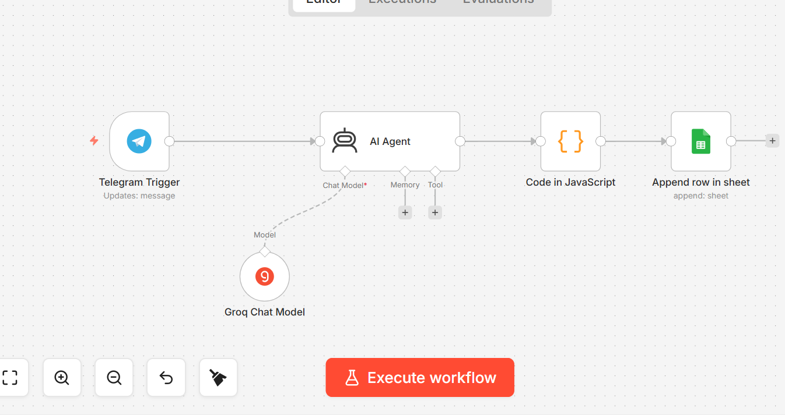

# n8n_telegrem_ai_timetable_sync-

An automated scheduling system using n8n, AI agents (Groq), and Telegram to generate and sync weekly timetables directly to Google Sheets
# 📅 AI-Powered Weekly Scheduler (n8n)

This project automates the creation of study or work schedules using AI and low-code automation.

## 🚀 How it works
1. **Trigger**: Send subjects and durations via **Telegram**.
2. **AI Processing**: **AI Agent** (using Groq) analyzes the text and creates a logical schedule.
3. **Data Transformation**: Custom **JavaScript** formats the AI output.
4. **Output**: Automatically appends the schedule to **Google Sheets**.

## 🛠️ Tools Used
* [n8n](https://n8n.io/) - Workflow Automation
* [Groq](https://groq.com/) - LPU Inference Engine
* [Google Sheets API](https://developers.google.com/sheets/api)
* [Telegram Bot API](https://core.telegram.org/bots)

## 📁 Repository Structure
* `workflow.json`: The main n8n workflow file.
